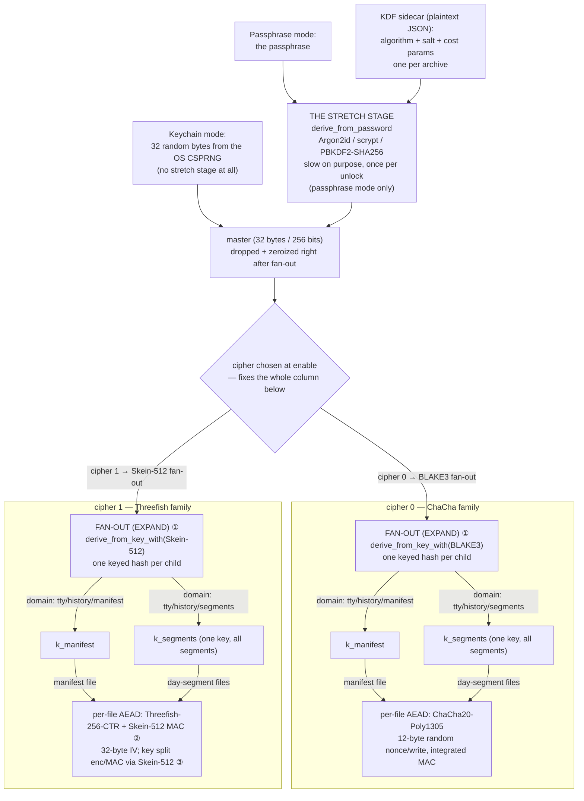

# Encrypted history: key architecture

The complete key-derivation and encryption pipeline behind encrypted command
history — one document for the whole picture, since the decisions are spread
across ADRs 0006 (the feature), 0007 (key sources, KDFs), and 0008 (untracked
sessions). Those ADRs record *why* each decision was made; this describes the
system as built, names what is standard practice versus a local choice, and
keeps the open refinement options in one place. Update it when the design
moves.

## The pipeline

The cipher is picked once at enable, and that single choice fixes the whole
column beneath it: *both* the fan-out PRF (so it stays in the cipher's family)
*and* the per-file AEAD. Read top to bottom, the fan-out always precedes the
AEAD — it produces the per-purpose child keys the AEAD then consumes on every
write.

`Auto` is the default pairing shown above; an explicit override can force the
other PRF in either column (the choice is fixed per archive either way).

Every blob on disk is `cipher_id ‖ nonce ‖ ciphertext+tag` (see
`history/crypto.rs`); the KDF sidecar (`tty.history.kdf.json`, passphrase
source only) is plaintext JSON holding the algorithm tag, one random 16-byte
salt for the whole archive, and that algorithm's cost parameters.

## The three quantities

Each stage contributes exactly one thing, and none can substitute for
another:

| Stage | Contributes | Notes |
|---|---|---|
| The secret itself | **entropy** | The only source. Keychain: 256 bits of OS randomness. Passphrase: however guessable the passphrase is. No later stage can add entropy — deterministic functions only preserve or lose it. |
| `derive_from_password` | **work** | Cost per attacker guess (memory-hard for Argon2id/scrypt). Work is the *substitute* for missing entropy; with a random master there is nothing missing, which is why keychain mode has no stretch stage at all. |
| `derive_from_key` | **structure** | Independent, purpose-labeled children. No work, no entropy — compartments. |

## The two derivation APIs

Both live in `dorado_engine::kdf` (dorado owns all cryptography; tty owns
only scope — the sidecar, the domains, the session lifetime):

- `derive_from_password(params, password, salt, out)` — **the stretch
  stage** (a PBKDF; HKDF would call it Extract). Needs a
  salt (stored, random, defeats precomputation) and tunable costs
  (`validate` bounds untrusted ones, so a corrupted sidecar can't demand
  gigabytes). User-selectable algorithm (`Settings::history_kdf`), matching
  industry convention — KeePass, Bitwarden, and LUKS2 all expose this choice,
  because the algorithms genuinely differ (memory-hard vs compute-hard, FIPS
  environments).
- `derive_from_key_with(prf, key, domain, out)` — **the fan-out stage** (a
  KBKDF; HKDF would call it Expand): one domain-separated keyed hash (message
  = fixed `DRDOkdrv` prefix ‖ domain). The `prf` is `Skein512` or `Blake3`,
  chosen to match the cipher's family (`settings::HistoryFanout`): BLAKE3 for
  ChaCha20-Poly1305, Skein-512 for the Threefish cipher, so each configuration
  is single-family top to bottom (the precedent is TLS 1.3's per-suite HKDF
  hash). Both are secure PRFs and produce equally strong children — the choice
  changes lineage, not strength, so `Auto` (follow the cipher) is the default
  and the override is there for anyone who wants it. `derive_from_key(..)` is
  the `Skein512` shortcut. The output length is bound into Skein's config (so
  different lengths are unrelated); BLAKE3 is an XOF (a longer output extends a
  shorter one), which is why each child uses its own domain rather than
  slicing one stream.

The parallel names are the guardrail: a password must never take the fast
path (no stretching = still guessable), a key never needs the slow one.

## The key hierarchy

`history::HistoryKeys::from_master` fans the master into two children under
the archive's fan-out PRF and the master is dropped (zeroized) immediately —
for the rest of the session only the children exist, in the writer thread and
the read path:

- `derive_from_key_with(prf, master, "tty/history/manifest")` → `k_manifest`
  — the date→segment index (also the unlock's auth check: wrong passphrase =
  `AuthFailed` here).
- `derive_from_key_with(prf, master, "tty/history/segments")` → `k_segments`
  — every
  day-segment file. One key for all segments; per-write freshness comes from
  AEAD nonces, not from keys (random 96-bit nonces don't risk collision
  until ~2^48 writes). Derivation runs twice per session, ever — new days
  reuse `k_segments`; nothing scales with file count.

What the hierarchy defends: a leaked *child* stays confined (one-way, no
path back to the master or sideways to a sibling); a bug in one code path
(e.g. nonce misuse) stays in its compartment; a segment blob can never be
accepted where the manifest belongs (tested: `AuthFailed`). What it cannot
defend: master compromise — the domains are public constants, so whoever
holds the master can mint every child. That is Kerckhoffs working as
intended: all secrecy lives in the master, whose guardianship is the
keychain's (unlocked OS session) or the passphrase's (KDF cost per guess).

## Where Skein sits, and the family-matched fan-out

Skein appears in up to three roles:

1. **Fan-out KDF** (role ① above) — but only when the fan-out PRF resolves to
   Skein, i.e. the Threefish cipher (or an explicit override).
2. **Per-chunk MAC** inside cipher 1's raw-authenticated construction.
3. **AEAD key split** (enc/MAC halves) inside cipher 1.

Roles ② and ③ exist only under the Threefish cipher. Role ① used to be Skein
unconditionally, which put keyed Skein-512 in the key path of the otherwise
all-mainstream Argon2id + ChaCha20-Poly1305 configuration — sound (it is
exactly HKDF's extract-then-expand, and Skein is a SHA-3 finalist
differentially tested here against an independent crate), but cross-family.
The fan-out PRF now matches the cipher by default: the ChaCha configuration
fans out with **BLAKE3** (ChaCha-family), so Skein appears nowhere in it, and
the Threefish configuration fans out with Skein, which it already relied on
via role ③. A user can still override the PRF in either direction; the choice
is fixed per archive, since the same master under a different PRF derives
different children. In passphrase mode the weakest link remains the passphrase
regardless.

## Standard vs local choices

| Choice | Status |
|---|---|
| Two-stage stretch-then-expand | Universal (HKDF, TLS 1.3, Signal, libsodium, age, Bitwarden). |
| Per-purpose subkeys (domain-separated fan-out) | Universal. |
| Stretch algorithm user-selectable | Common (KeePass, Bitwarden, LUKS2). |
| Fan-out PRF user-selectable (Auto = family-matched) | Uncommon (most tools hardcode it); here it defaults to the cipher's family and the override is an explicit, honestly-labeled extra. |
| Salt scope: one per archive (sidecar), derive once per session | Standard for session-holding apps; dorado's *container* (salt per file, KDF per read) is the standalone-file counterpart, deliberately unused here. |
| Master derived directly from the passphrase | Common (age, Bitwarden) but not the only school — see the KEK option below. |

## Built since the first draft

- **Family-matched fan-out with a user override.** The fan-out PRF now
  matches the cipher's family by default (BLAKE3 for cipher 0, Skein-512 for
  cipher 1), with an explicit `Auto`/`Skein-512`/`BLAKE3` knob in the enable
  dialog (`settings::HistoryFanout`, `dorado_engine::kdf::derive_from_key_with`).
  Each configuration is single-family top to bottom; the override exists
  because both PRFs are equally correct and someone may want the other lineage.
  Fixed per archive (changing it means a Reset), like the cipher.
- **Argon2id headroom.** The default recipe moved from OWASP's server floor
  (19 MiB, t=2) to 64 MiB, t=3 — a once-per-session local unlock can spend a
  few tenths of a second, which is a much steeper bill for a GPU/ASIC rig. New
  archives only; an existing archive keeps whatever its sidecar recorded.

## Open refinement options

Candidates discussed and deliberately not (yet) built. Any option that
changes what key existing archives decrypt under is cheapest **now**, while
archives are test data and Reset is painless.

1. **Wrap a random master (KEK model).** Make the master random even in
   passphrase mode; the KDF output becomes a key-encryption-key that wraps
   the master on disk (LUKS2/restic/FileVault school). Buys passphrase
   change without re-encrypting the archive, multiple passphrases, and
   converges the two modes (the master is always random; the source only
   guards access). The largest of these changes: a wrapped-master blob, new
   unlock path, migration story.
2. **Per-file segment keys.** A third hierarchy level,
   `derive_from_key(k_segments, filename)`, binds each segment to its name
   and closes the swap-two-segment-files gap (an attacker with disk write
   access can mislabel days, though never read or forge). Cheap; call-site
   only; archive-compat break.
3. **An all-dorado stretch option.** PBKDF2-HMAC-Skein512 as a fourth
   `history_kdf` choice (dorado has from-scratch keyed Skein). Compute-hard
   only and nonstandard — would be labeled honestly, like the Threefish
   cipher option. Mostly of thematic value.

## Pointers

- ADR 0006 — the feature: archive layout, ciphers, keychain, failure policy.
- ADR 0007 — key sources, async startup, the KDF choice, this hierarchy.
- ADR 0008 — untracked sessions (orthogonal to keys: suppression at the
  event source, before anything here runs).
- Code: `tty/src/history/{mod,crypto,passphrase,keychain,writer}.rs`;
  `dorado/rust/crates/dorado-engine/src/kdf.rs`.
